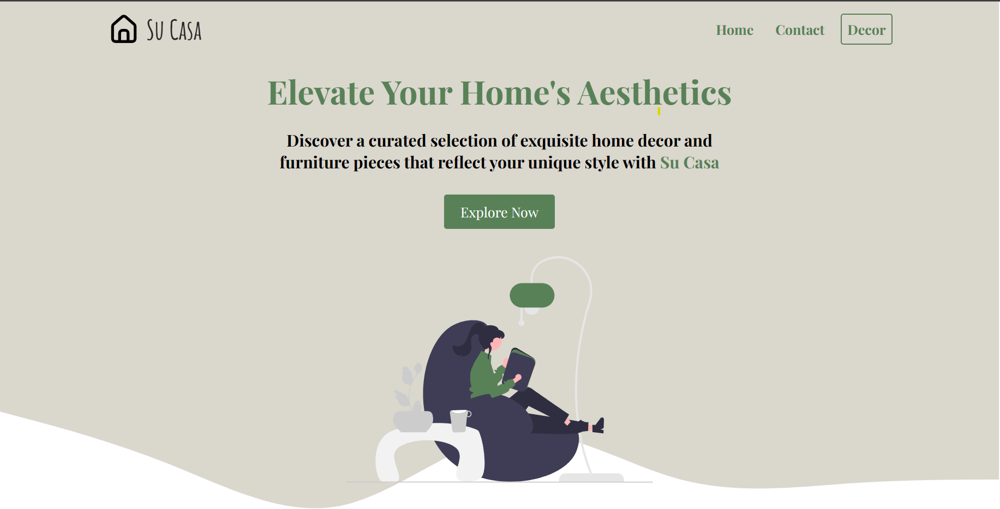
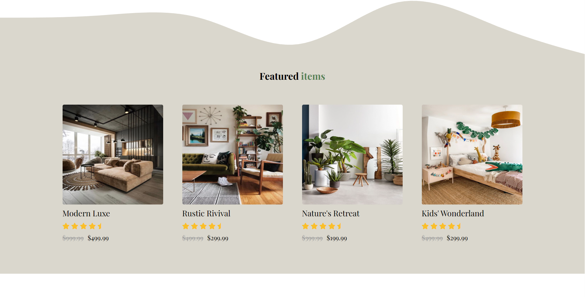

# Su Casa - E-commerce Home Decor Website

Welcome to Su Casa, an e-commerce platform dedicated to offering a curated selection of exquisite home decor and furniture pieces. Elevate your home's aesthetics with our diverse range of styles, all while maintaining affordability and elegance.

**Note:** This is a static proof-of-concept website intended to showcase front-end development skills and is not fully functional for online transactions.

## Table of Contents

- [Features](#features)
- [Preview](#preview)
- [Image Sources](#image-sources)
- [Technologies Used](#technologies-used)
- [View Live](#view-live)
- [Contributing](#contributing)
- [License](#license)

## Features

- **Engaging UI:** Clean and visually appealing design to enhance user experience.
- **Responsive:** Fully responsive layout for optimal viewing across devices.
- **Interactive Elements:** Interactive navigation, image sliders, and product showcases.
- **Styled Components:** Utilizes CSS and Font Awesome for styling and icons.
- **Illustrations:** SVG illustrations from Undraw to complement the design.

## Preview

## Image Sources

The images used in this project were sourced from various online platforms, including Pinterest, through general searches. The original creators and sources of these images are appreciated for their creative work.

## Technologies Used

- [HTML](https://developer.mozilla.org/en-US/docs/Web/HTML)
- [CSS](https://developer.mozilla.org/en-US/docs/Web/CSS)
- [JavaScript](https://developer.mozilla.org/en-US/docs/Web/JavaScript)
- [Font Awesome](https://fontawesome.com/) for icons
- [Undraw](https://undraw.co/) for SVG illustrations

## View Live

Explore the Su Casa website here: 

## Contributing

This project is a showcase of my front-end development skills and is not actively seeking contributions. However, feedback and suggestions are always welcome!

## License

This project is licensed under the [MIT License](LICENSE), which means you are free to use, modify, and distribute the code for both personal and commercial purposes. Attribution is not required but appreciated.
